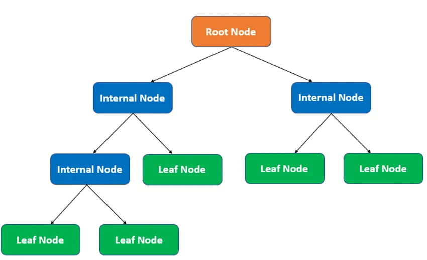
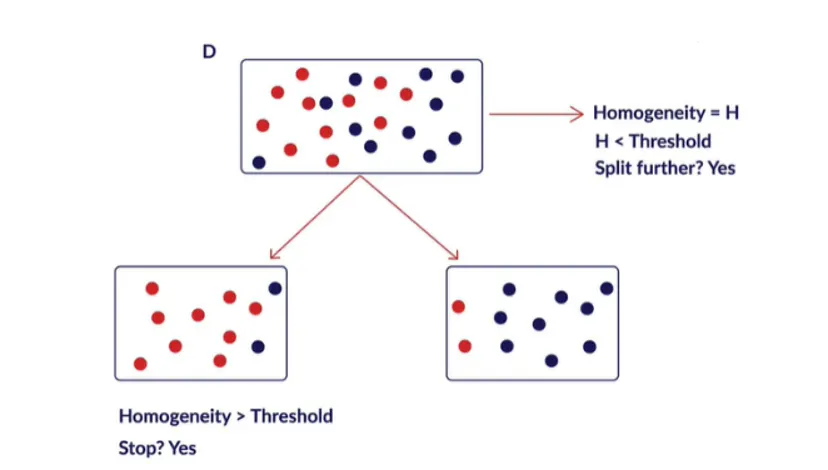
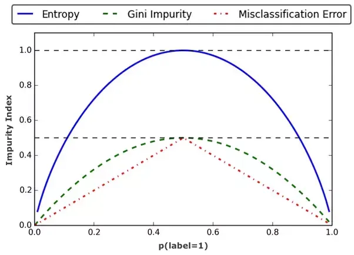
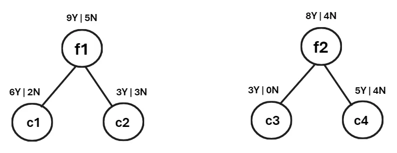

# Decision Tree

The Decision Tree is one of the most commonly used machine learning models. It can be used as a classifier, similar to logistic regression, but unlike logistic regression, which performs a single-level classification, a decision tree works through multiple levels of decision-making.

At each level, the data is split based on specific feature-based criteria — these points of division are known as nodes. This hierarchical structure allows the model to make decisions step by step, leading to more refined and interpretable results.

Decision trees can be used to solve both regression and classification problems. The main difference lies in how the leaf nodes (the final nodes in the hierarchy) determine the output:

- For regression, each leaf node represents the average value of the target variable for the samples in that node.
- For classification, each leaf node represents the class with the highest number of votes (i.e., the majority class among the samples in that node).

**Since we already have regression and classification models, why do we need decision trees?**

Traditional models like regression and classification require several assumptions and preprocessing steps — such as checking for multicollinearity, ensuring feature scaling, and maintaining linear relationships between variables.

However, decision trees do not rely on these assumptions. They can naturally handle non-linear relationships, unclean or unscaled data, and correlated features without much preprocessing. This makes them easier to use, more flexible, and often more interpretable compared to traditional regression or classification models.

## Characteristics of Decision Trees

- **Highly interpretable** : The prediction process is easy to understand and visualize, as it follows a clear rule-based structure.
- **Handles all types of data** : Works well with both numerical and categorical data, with little to no need for preprocessing such as scaling or normalization.
- **Fast and efficient** : Training and prediction are computationally efficient, especially for small to medium-sized datasets.
- **Captures complex relationships** : Can model non-linear and complex feature interactions effectively.
- **Sensitive to data changes** : Decision trees are somewhat volatile — small changes in data can lead to a completely different tree structure.

## Important concepts for Decision Tree :

Initially, every decision tree starts with a root node that contains the entire dataset. From this point, the data is split into smaller subsets based on certain conditions. But how does this splitting actually happen? What criteria are used, and which features are chosen for each split? In this section, we’ll explore and address all these questions in detail.

## Homogeneity and Splitting

Let’s consider a dataset where we can split the data based on certain variables.
For example, if we split the dataset using the condition A > 10, we might end up with two groups—one containing 60% of one class and 40% of another. This seems like a reasonable split.
However, if we instead split on B > 10, we might get 5% of one class and 95% of another.

From this, two important questions arise:

- Which variable should we choose for splitting?
- Is it even necessary to split at this point?

To answer these, we introduce the concept of homogeneity, which measures how “pure” or similar the items in a group are. A highly homogeneous group means most of its elements belong to the same class.

In decision trees, data is split based on this homogeneity criterion—the goal is to make each resulting subset as pure (homogeneous) as possible.

There are several impurity measures used to calculate the homogeneity (or purity) of a node or split in a decision tree. These measures help determine how well a particular feature separates the data. The most commonly used impurity metrics are:

- Classification Error – Measures the fraction of incorrectly classified samples in a node.
- Gini Index – Measures the probability of incorrectly classifying a randomly chosen element.
- Entropy – Measures the level of uncertainty or randomness in the data; higher entropy means more disorder (less homogeneity).

Each of these metrics helps the algorithm decide the best feature and threshold for splitting to create the most homogeneous child nodes.

### Classification Error:

The Classification Error is one of the simplest measures used to evaluate the impurity of a node in a decision tree. It represents the proportion of samples that do not belong to the majority class within that node.

The formula is given by:

  $$
  \text{Classification Error (E) = 1 - max(p)}
  $$

where p is the probability of each class in the node.

Example:
Suppose we have a dataset of 100 samples. After a split, we get:
- 40 samples of one class
- 60 samples of another class

We can compute the class probabilities as: 

$$
\text{p(40)} = \frac{40}{100} = 0.4
$$
$$
\text{p(60)} = \frac{60}{100} = 0.6
$$
$$
\text{E}  = 1 - max(p) = 1 - 0.6 = 0.4
$$

### Gini Index

The Gini Index (or Gini Impurity) measures how often a randomly chosen sample would be incorrectly classified if it were labeled according to the class distribution in a node.
A lower Gini value indicates higher purity (more homogeneous node).

The formula is:

$$
Gini(G) = 1 -  \sum_{i=1}^n p_i^2
$$

Example : 
We take the same example as previous

$$
  Gini(G) = 1 -  (p(40)^2 + p(60)^2)
$$
$$
  Gini(G) = 1 -  ((0.4)^2 + (0.6)^2) = 1 - (0.16+0.36) = 0.48
$$

### Entropy
The Entropy metric measures the amount of disorder or randomness in a node.
A perfectly pure node (all samples belong to one class) has entropy = 0, while a completely mixed node has the highest entropy.

The formula is:

$$
Entropy(D) =  -  \sum_{i=1}^n p_i log_2 (p_i)
$$

Example : 
We take the same example as previous

$$
Entropy(D) =  - p(40)log_2 p(40) - p(60)log_2 p(60)
$$
$$
Entropy(D) =  - 0.4log_2 0.4 - 0.6log_2 0.6 = - 0.4 \times (-1.32) - 0.6 \times (-0.737) = 0.971
$$

Now, selecting one of these impurities, we can decide whether to split the node:

Homogeneity (H) =
- Classification Error (E) = 0.4 → If the calculated E for the current node is greater than the defined threshold (in our case 0.5), then split the node.
- Gini Index (G) = 0.48 → If the calculated G for the current node is greater than the defined threshold (e.g., 0.4), then split the node.
- Entropy (D) = 0.971 → If the calculated H for the current node is greater than the defined threshold (e.g., 0.5), then split the node.

So far, we have only discussed when to split a node. But what about which variable to split on? How do we decide which feature or attribute should be used to perform the split?

This question leads us to the next important step in building a decision tree: selecting the best splitting variable based on impurity reduction.

### Variable/ Attribute selection for split

The importance of a variable is measured using the Information Gain factor.

Information Gain represents the reduction in impurity achieved by splitting a node on a particular variable.
- If the impurity decreases significantly after the split, the information gain is high, indicating that the variable is effective at creating more homogeneous child nodes.
- In other words, the higher the information gain, the better the variable is at reducing impurity and making the split meaningful.

Formula :

$$ 
Δimpurity = (Pre-split Impurity) - (Post-split Impurity)
$$
$$ 
Gain = D - D_A
$$

post-split impurity is calculated by the weighted averagre of the two child nodes

Example : 

Lets see the left tree information gain, 

entropy of node f1
